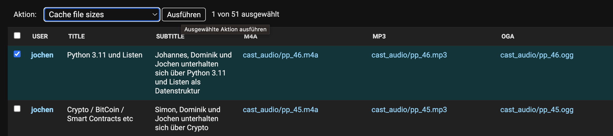

Features
========

Django-Admin
------------

The file sizes of an audio object are cached automatically. But
for old audio objects there's an admin action where you can update
the file size cache for all associated audio files.

