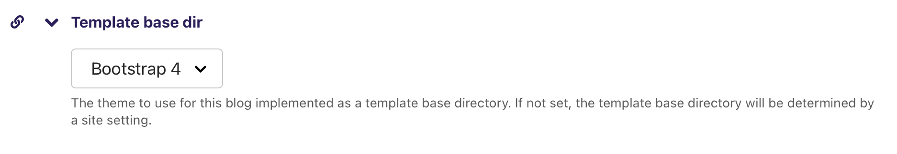

########
Features
########

********
Frontend
********

Pagination
==========

The blog index page comes with pagination support. You can set the
number of posts per page using the `POST_LIST_PAGINATION` setting.

If there are more then 3 pages, there will be a "..." in the pagination.
If there are more then 10 pages, there will be two "..." in the pagination.

************
Django-Admin
************

The file sizes of an audio object are cached automatically. But
for old audio objects there's an admin action where you can update
the file size cache for all associated audio files.

.. image:: images/cache_file_sizes_admin_action.png
  :width: 800
  :alt: Show the admin action to update the file size cache

.. include:: social-media.rst

.. include:: spamfilter.rst

****
Blog
****

Blog / Podcast Author
=====================

If you set the custom `CharField` field named `author` on a Blog-Page
using the Wagtail or Django-Admin interface, the content of this field
is then used to populate following attributes in the feed:

- `itunes:author`
- `itunes:name`
- `author_name` in atom feed

If the `author`-field is not set `blog.owner.get_full_name()` is used instead.

Blog / NoIndex
==============

If you set the custom `BooleanField` field named `noindex` on a Blog-Page
using the Wagtail or Django-Admin interface, the Page and all its subpages
will be excluded from being indexed by search engines.

*********
Templates
*********

It's possible to use different templates for the whole site or different
blogs. The built-in templates should be selectable right from the Wagtail
admin interface:

* Plain HTML (plain)
* Bootstrap 4 (bootstrap4)

If you want to use your own templates, you can do so by overwriting the
built-in templates or creating a new directory in your project's
`templates` directory and name it `cast/{your_template_name}`. Then
you can create your own templates in this directory. After all of
the following template names are added, you should be able to select
your custom template in the Wagtail admin interface.

.. important::

    This is the minimal list of templates that have to be implemented
    for a template named **minimal**:

    * `cast/minimal/blog_list_of_posts.html`
    * `cast/minimal/post.html`
    * `cast/minimal/post_body.html`
    * `cast/minimal/episode.html`

.. hint::

    It's only possible to create own template themes with template
    loaders that implemexnt the `get_dirs` method (FilesystemLoader,
    CachedLoader).

How to Change the Theme for the whole Site
==========================================

This setting can be found at `settings > Template base directory`:

.. image:: images/template_base_dir_setting.png
  :width: 600
  :alt: Set the theme or "template base directory" for the whole site

How to Change the Theme for a Single Blog
=========================================

This setting can be found at `pages > ... > Blog`:

