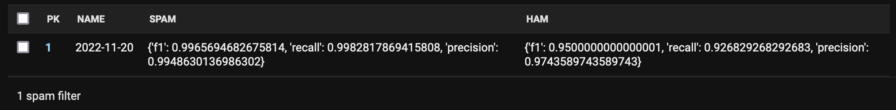

.. _comments:

********
Comments
********

Django Cast provides a full commenting system built on top of
`django-contrib-comments <https://django-contrib-comments.readthedocs.io/>`_.
Comments can be enabled or disabled at three levels:

App level
    The global :ref:`CAST_COMMENTS_ENABLED <cast_comments_enabled>` setting
    (defaults to ``False``).

Blog level
    Each ``Blog`` model has a ``comments_enabled`` field (defaults to ``True``).

Post level
    Each ``Post`` model also has a ``comments_enabled`` field (defaults to
    ``True``).

A comment form is only rendered when **all three levels** evaluate to enabled.

.. _comments_configuration:

Configuration
=============

To enable the built-in comments integration, set:

.. code-block:: python

   COMMENTS_APP = "cast.comments"

.. _comments_settings:

Settings
--------

``CAST_COMMENTS_ENABLED``
    Master switch for the entire comment system. Set to ``True`` to enable
    comments. Defaults to ``False``.

``CAST_COMMENTS_EXCLUDE_FIELDS``
    Tuple of form field names to hide from the comment form. Useful for
    removing fields like ``email``, ``url``, or ``title``. Defaults to ``()``.
    Also accepts the legacy name ``FLUENT_COMMENTS_EXCLUDE_FIELDS``.

``CAST_COMMENTS_DEFAULT_MODERATOR``
    Dotted Python path to a moderator class. The class must provide ``allow()``
    and ``moderate()`` methods (see :ref:`comments_moderation`). Set to
    ``"none"``, ``"null"``, ``"default"``, or ``""`` to use a built-in
    ``NullModerator`` that allows all comments and never moderates. Defaults to
    ``"cast.moderation.Moderator"`` (the built-in spam filter moderator).
    Also accepts the legacy name ``FLUENT_COMMENTS_DEFAULT_MODERATOR``.

``CAST_COMMENTS_ALLOW_AUTHOR_EDITS``
    Opt-in switch that lets an anonymous author edit or delete their own
    comment from the same browser. Defaults to ``False``. See
    :ref:`comments_author_edits` for the behaviour, requirements, and privacy
    implications.

``CAST_COMMENTS_FORM_CSS_CLASS``
    CSS class applied to the comment form. Defaults to
    ``"comments-form form-horizontal"``.

``CAST_COMMENTS_LABEL_CSS_CLASS``
    CSS class for form labels (crispy-forms). Defaults to ``"col-sm-2"``.

``CAST_COMMENTS_FIELD_CSS_CLASS``
    CSS class for form field wrappers (crispy-forms). Defaults to
    ``"col-sm-10"``.

``CRISPY_TEMPLATE_PACK``
    The crispy-forms template pack used for rendering form fields and AJAX
    error messages. Not specific to django-cast but affects how comment form
    errors are rendered in AJAX responses. Defaults to ``"bootstrap4"``.

Example configuration:

.. code-block:: python

   COMMENTS_APP = "cast.comments"
   CAST_COMMENTS_ENABLED = True
   CAST_COMMENTS_EXCLUDE_FIELDS = ("email", "url", "title")
   CAST_COMMENTS_DEFAULT_MODERATOR = "cast.moderation.Moderator"

.. _comments_internals:

How ``COMMENTS_APP`` Integration Works
=======================================

Setting ``COMMENTS_APP = "cast.comments"`` tells ``django-contrib-comments``
to use the cast comments package. The package provides two hook functions
in its ``__init__.py``:

``get_model()``
    Returns ``CastComment``, a **proxy model** (``managed = False``) that
    adds a custom manager with ``select_related("user")`` for efficient
    queryset loading. When ``threadedcomments`` is installed, ``CastComment``
    inherits from ``ThreadedComment`` instead of the plain ``Comment`` model.

``get_form()``
    Returns ``CastCommentForm``, which extends the appropriate base form
    (``ThreadedCommentForm`` or ``CommentForm``). It removes fields listed in
    ``CAST_COMMENTS_EXCLUDE_FIELDS`` and reorders the remaining fields so
    security fields (``content_type``, ``object_pk``, ``timestamp``,
    ``security_hash``) appear first, the ``parent`` field follows in threaded
    mode, visible fields come next, and the ``honeypot`` field is placed last.

.. _comments_threaded_replies:

Threaded Replies
================

If ``threadedcomments`` is in ``INSTALLED_APPS``, threaded replies are
enabled automatically. The comment system detects the package at startup and
switches the base model from ``django_comments.models.Comment`` to
``threadedcomments.models.ThreadedComment``, which adds a ``parent`` foreign
key for nesting.

When threaded mode is active:

- The comment form includes a hidden ``parent`` field.
- Each rendered comment shows a "reply" link that sets the ``parent`` value via
  the JavaScript layer (see :ref:`comments_ajax_posting`).
- The comment list template uses ``fill_tree`` and ``annotate_tree`` filters
  from ``threadedcomments`` to produce nested ``<ul>`` markup.
- The flat list template (``flat_list.html``) is used when threaded comments are
  disabled.

.. note::

   Install ``django-threadedcomments`` and add ``"threadedcomments"`` to
   ``INSTALLED_APPS`` to enable threaded replies. No additional configuration
   is required.

.. _comments_ajax_posting:

AJAX Comment Posting
====================

Comments are posted asynchronously via a dedicated AJAX endpoint. The
JavaScript client (``ajaxcomments.ts``, built as an IIFE by Vite) intercepts
the comment form submission and uses ``fetch`` to POST to
``/comments/post/ajax/``. The request includes an
``X-Requested-With: XMLHttpRequest`` header so the server-side view can
distinguish it from a regular form submission.

.. _comments_ajax_server_flow:

Server-Side Flow
----------------

The ``post_comment_ajax`` view handles the request:

1. **Authentication check** -- if the user is logged in, ``name`` and
   ``email`` are auto-filled from the user profile when not provided.
2. **Target resolution** -- the ``content_type`` and ``object_pk`` fields
   identify the target object (typically a ``Post`` page).
3. **Form validation** -- the standard ``django_comments`` form is
   instantiated. Security hash and honeypot checks run first.
4. **Preview mode** -- if the ``preview`` button was clicked and the form is
   valid, the view renders the comment HTML and returns it without saving. If
   the form has errors, no comment object is produced and the response
   contains only the error details.
5. **Signal dispatch** -- ``comment_will_be_posted`` fires, giving the
   moderator (see :ref:`comments_moderation`) a chance to mark the comment
   as spam. If any receiver returns ``False``, the comment is rejected.
6. **Save and respond** -- the comment is saved, ``comment_was_posted``
   fires, and a JSON response is returned.

.. _comments_ajax_response:

JSON Response Format
--------------------

On success or form-validation errors, the AJAX endpoint returns a JSON object
with the following fields. Early failures (missing fields, invalid content
type, security hash mismatch) return a plain-text HTTP 400 response instead.

JSON fields:

``success``
    Boolean indicating whether the comment was accepted.

``action``
    Either ``"post"`` or ``"preview"``.

``errors``
    A dictionary of field-name to rendered error HTML (empty on success).

``html``
    The rendered comment HTML fragment, ready to insert into the page. Only
    present when a comment object was successfully created or previewed (absent
    on validation errors).

``comment_id``
    The database ID of the saved comment (absent on preview or error).

``parent_id``
    The parent comment ID when threaded replies are active (``null`` for
    top-level comments).

``is_moderated``
    Present only for staff users. ``true`` when the comment was auto-moderated
    (marked not public).

``use_threadedcomments``
    Boolean indicating whether threaded comment mode is active.

``object_id``
    The primary key of the commented-on object.

.. _comments_ajax_assets:

Client-Side Assets
------------------

The AJAX comment posting uses bundled assets under:

- ``fluent_comments/js/ajaxcomments.js``
- ``fluent_comments/css/ajaxcomments.css``

If these are not included in your templates, the form falls back to the
default django-contrib-comments flow (redirecting to ``comments/posted/`` and
``comments/preview/``).

The form template at ``comments/form.html`` sets
``data-ajax-action=""`` on the
``<form>`` element. The JavaScript reads this attribute to determine the
AJAX endpoint URL.

.. hint::

   The ```` template tag renders the
   cancel-reply link, a loading spinner, and success/moderation messages
   used by the JavaScript layer.

.. _comments_author_edits:

Author Self-Editing and Deletion
================================

By default, an anonymous comment is final once it is posted. Setting
:ref:`CAST_COMMENTS_ALLOW_AUTHOR_EDITS <cast_comments_allow_author_edits>` to
``True`` opts in to letting an author edit or delete **their own** comment from
the **same browser**. The setting is strict: only the literal ``True`` enables
the feature, so a stray string such as ``"False"`` (for example from an
environment variable) cannot switch it on by accident.

.. code-block:: python

   CAST_COMMENTS_ALLOW_AUTHOR_EDITS = True

.. _comments_author_edits_session:

Server-side session requirement
-------------------------------

Ownership is tracked entirely server-side: the ids of the comments created in
a browser are stored in that browser's Django session, and edit or delete
requests are authorized only against that list — never against anything the
client supplies. This requires a **server-side session backend**. The
``signed_cookies`` ``SESSION_ENGINE`` stores the session in a client-held
cookie, which cannot be revoked, so it is rejected by the cast system checks
(``cast.E006``). Use the database, cache, or file session backend instead.

.. _comments_author_edits_behavior:

Behaviour
---------

Once enabled, an author who posted a comment from the current browser sees
edit and delete controls on that comment:

- The controls are available **until someone replies** to the comment or the
  **session expires**, whichever comes first. After a reply lands the comment
  is frozen and the controls disappear, so editing history cannot diverge from
  a conversation that already built on it.
- Edits are **re-moderated**. An edited comment goes back through the spam
  filter (see :ref:`comments_moderation`), so an edit can become hidden pending
  moderation just like a freshly posted comment. Edited comments are marked
  with an ``(edited)`` flag.
- Deletion is a **soft delete**, not erasure. The comment is hidden from
  readers but kept in the database, and staff can restore it from the Django
  admin (see :ref:`comments_manual_moderation`).

Scope and limitations
~~~~~~~~~~~~~~~~~~~~~~~

- The edit/delete controls and the inline editor are **server-rendered into the
  comment templates and driven by the bundled comment JavaScript**. They apply to
  any server-rendered theme that uses the shared comment template and the bundled
  ``ajaxcomments.js`` (the built-in ``bootstrap4``, ``bootstrap5`` and ``plain``
  themes). A single-page or API-driven comment UI (for example a custom front end
  consuming the comment API) does not receive the controls automatically and would
  need its own integration.
- While the feature is enabled, **threaded replies must be posted through the
  AJAX endpoint** (the reply form). The plain non-JavaScript ``POST`` to the
  stock comment view is rejected for replies, because only the AJAX path locks
  the parent row to coordinate with concurrent edit/delete. Top-level comments
  still post without JavaScript. If your site relies on no-JavaScript threaded
  replies, keep the feature disabled.

Two optional tunables limit abuse and bound session size (both only apply when
the feature is enabled):

- :ref:`CAST_COMMENTS_OWNED_IDS_CAP <cast_comments_allow_author_edits>` caps how
  many owned comment ids are kept per session (default ``200``). ``0`` means **no
  cap** (keep every id).
- :ref:`CAST_COMMENTS_EDIT_RATE_LIMIT <cast_comments_allow_author_edits>` and
  :ref:`CAST_COMMENTS_EDIT_RATE_WINDOW <cast_comments_allow_author_edits>` cap
  how many edit/delete actions a session may perform within a fixed cache
  window (defaults ``30`` actions per ``60`` seconds). A rate limit of ``0``
  **disables** rate limiting; the window must be a positive number of seconds.

.. _comments_author_edits_privacy:

Privacy note
------------

Enabling this feature sets a **functional session cookie** for anonymous
commenters who were previously cookieless: a session is needed to remember
which comments the browser owns. Take this into account for your cookie and
privacy disclosures before turning the feature on.

.. _comments_template_tags:

Template Tags
=============

The ``fluent_comments_tags`` template tag library provides several tags and
filters for rendering comments in templates.

````
    Renders the AJAX helper markup (cancel-reply link, loading spinner,
    success message, moderation notice for staff). Accepts both
    ```` and ````
    syntax.

````
    Renders a single comment using the appropriate template from the
    lookup chain: ``comments/<app>/<model>/comment.html``,
    ``comments/<app>/comment.html``, ``comments/comment.html``.

````
    Renders the full comment list. Uses ``threaded_list.html`` when threaded
    comments are active, ``flat_list.html`` otherwise.

``{{ object|comments_are_open }}``
    Filter that returns ``True`` if comments are enabled for the object.
    Checks the object's ``comments_are_enabled`` attribute.

``{{ object|comments_are_moderated }}``
    Filter that returns whether comments require pre-approval for the object.
    Currently always returns ``False`` (all moderation is handled
    post-submission by the spam filter).

``{{ object|comments_count }}``
    Filter that returns the number of comments for the object.

.. _comments_moderation:

Comment Moderation
==================

Django Cast provides an automatic moderation workflow that integrates with
the ``comment_will_be_posted`` signal from ``django-contrib-comments``.

.. _comments_moderation_flow:

Moderation Flow
---------------

The moderator is declared as a module-level ``SimpleLazyObject``. It is not
resolved at import time -- the ``CAST_COMMENTS_DEFAULT_MODERATOR`` setting is
read and the moderator class instantiated on first attribute access (i.e.,
when the first comment is submitted). The resolved instance is then reused
for all subsequent comments.

When a comment is submitted:

1. The ``on_comment_will_be_posted`` signal receiver calls the moderator's
   ``allow()`` method. If it returns ``False``, the comment is rejected
   entirely (the signal receiver returns ``False``, causing the view to
   return an error).
2. The moderator's ``moderate()`` method is called. It can mark the comment as
   spam by setting ``is_removed = True`` and ``is_public = False``.

The default ``cast.moderation.Moderator`` class:

- **Always allows** comments (``allow()`` returns ``True``) -- even spam
  comments are kept as training data for the classifier.
- **Auto-classifies** comments using the spam filter. If the filter predicts
  ``"spam"``, the comment is saved with ``is_removed = True`` and
  ``is_public = False``. Otherwise, the comment is published immediately.

.. note::

   Staff users see a "(moderated)" flag next to auto-moderated comments, and
   the AJAX response includes ``is_moderated: true`` so the JavaScript can
   display a notice.

.. _comments_manual_moderation:

Manual Moderation
-----------------

Comments that were auto-moderated (or manually flagged) can be managed through
the Django admin:

- In the **Comments** admin, toggle ``is_public`` and ``is_removed`` to
  approve or reject individual comments.
- Correcting mis-classified comments (marking spam as public, or ham as
  removed) improves future classifier accuracy after retraining.

.. _comments_spam_filter:

Comment Spam Filter
===================

Django Cast includes a
`Naive Bayes <https://en.wikipedia.org/wiki/Naive_Bayes_classifier>`_
spam classifier implemented in pure Python (``src/cast/models/moderation.py``).
It is fast, easy to train, and effective at filtering most spam.

.. _spam_filter_architecture:

Architecture
------------

The spam filter consists of three main components:

``NaiveBayes``
    The classifier itself. Stores prior probabilities per label and
    per-word label counts. Supports ``fit()``, ``predict()``, and
    ``predict_label()`` methods.

``SpamFilter`` (Django model)
    Persists a trained ``NaiveBayes`` instance in a ``JSONField`` along with
    performance metrics. The ``model`` field uses custom ``ModelEncoder`` /
    ``ModelDecoder`` classes for JSON serialization of the classifier.

``Evaluation``
    Cross-validation harness that measures precision, recall, and F1 score
    using stratified k-fold splits (default: 3 folds).

.. _spam_filter_training:

Training
--------

Training data is derived directly from existing comments:

- A comment is labeled **ham** if ``is_public = True`` and
  ``is_removed = False``.
- All other comments are labeled **spam**.

Each comment is converted to a message string by concatenating its ``name``,
``email``, ``title``, and ``comment`` fields. The classifier tokenizes this
string into lowercase words (using the regex pattern ``\b\w\w+\b``) and
builds per-word label frequency counts.

.. code-block:: python

   # How a comment becomes a training message
   message = f"{comment.name} {comment.email} {comment.title} {comment.comment}"

.. _spam_filter_classification:

Classification
--------------

When a new comment arrives, the ``Moderator.moderate()`` method:

1. Converts the comment to a message string.
2. Uses the ``SpamFilter`` instance that was loaded during ``Moderator``
   initialization (``SpamFilter.get_default()`` is called once in
   ``__init__``, not on every comment).
3. Calls ``predict_label(message)`` on the stored ``NaiveBayes`` model.
4. If the predicted label is ``"spam"``, the comment is marked as removed and
   not public.

The classifier computes posterior probabilities for each label by multiplying
the prior probability by each word's conditional probability, normalizing
after each word. The label with the highest final probability wins.

.. _spam_filter_retraining:

Retraining
----------

After moderating a batch of comments (approving legitimate ones, leaving spam
as removed), retrain the filter via the Django admin:

1. Navigate to the **Spam filters** admin page.
2. Select the spam filter instance.
3. Choose the **"Retrain model from scratch using marked comments"** action.

The retrain action:

- Collects all comments and labels them as ham or spam based on their current
  ``is_public`` / ``is_removed`` status.
- Fits a new ``NaiveBayes`` model on the full dataset.
- Runs a 3-fold stratified cross-validation to compute precision, recall,
  and F1 for both the "ham" and "spam" classes.
- Saves the updated model and performance metrics to the database.

.. _spam_filter_evaluation:

Evaluation Metrics
------------------

The ``Evaluation`` class performs stratified k-fold cross-validation:

1. Comments are split by label so each fold has a proportional mix of ham and
   spam.
2. For each fold, a fresh ``NaiveBayes`` model is trained on the remaining
   folds and evaluated on the held-out fold.
3. A confusion matrix (true positives, false positives, false negatives) is
   built per label.
4. Precision, recall, and F1 are computed from the final fold's confusion
   matrix.

The resulting metrics are stored in the ``SpamFilter.performance`` JSON field
and displayed as read-only ``spam`` and ``ham`` columns in the admin list view.

.. hint::

   If classification quality degrades, check the balance of ham vs. spam in
   your comment dataset. The classifier works best when both classes have a
   reasonable number of examples.

.. _spam_filter_json_serialization:

JSON Serialization
------------------

The trained ``NaiveBayes`` model is stored in a ``JSONField`` using custom
encoder/decoder classes:

``ModelEncoder``
    Serializes a ``NaiveBayes`` instance to a JSON dictionary containing
    ``prior_probabilities`` and ``word_label_counts``.

``ModelDecoder``
    Deserializes the JSON dictionary back into a ``NaiveBayes`` instance,
    keyed by the ``"class": "NaiveBayes"`` marker.

This allows the trained model to survive database migrations and
backup/restore cycles without any external file dependencies.
