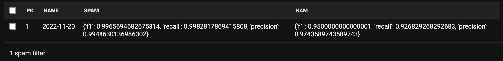

********
Comments
********

You can enable / disable comments on app, blog and post-level. For app-level,
there's a global switch you can use in the :ref:`settings <cast_comments_enabled>`.
Blog and post models have a comments_enabled database field. They are set
to ``True`` by default.

Configuration
=============

To enable the built-in comments integration, set:

.. code-block:: python

   COMMENTS_APP = "cast.comments"

Optional settings:

.. code-block:: python

   CAST_COMMENTS_EXCLUDE_FIELDS = ("email", "url", "title")
   CAST_COMMENTS_DEFAULT_MODERATOR = "cast.moderation.Moderator"

Caveats
=======

The AJAX comment posting uses bundled assets under:

- ``fluent_comments/js/ajaxcomments.js``
- ``fluent_comments/css/ajaxcomments.css``

If these aren’t included in your templates, the form will fall back to the default
django-contrib-comments flow (redirecting to ``comments/posted/`` and ``comments/preview/``).

Comment Spam Filter
===================

There's a simple
`Naive Bayes-based <https://en.wikipedia.org/wiki/Naive_Bayes_classifier>`_
spam filter for comments built in. It's not very smart, but it's good
enough to filter out most spam. It's also very easy to train and very fast
to run. And it's only slightly above one hundred lines of pure Python code.

A comment is considered ham if it's public and not removed. All other comments
are considered spam. It's possible to re-train the spam filter via a
`Django Admin <https://docs.djangoproject.com/en/4.1/ref/contrib/admin/>`_
action on the :code:`SpamFilter` model. The precision, recall and F1 performance
indicators are also shown in the admin interface.

