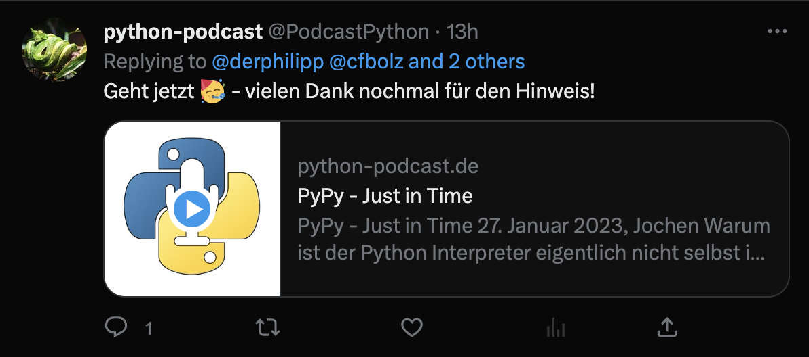

.. _social_media:

************
Social Media
************

Django Cast automatically generates Open Graph and Twitter Card meta tags
for posts and episodes, enabling rich social previews when links are shared.

.. _social_cover_images:

Social Cover Images
===================

Cover images are the primary visual element in social previews. Django Cast
uses a two-level fallback for the cover image:

1. The post's or episode's own ``cover_image`` field (set in the Wagtail
   editor).
2. The parent blog's ``cover_image`` field as a fallback.

If neither is set, no image meta tags are emitted.

The social preview image is generated as a **1200x630 JPEG** rendition using
Wagtail's focal-point-aware cropping (rendition spec:
``fill-1200x630|format-jpeg|jpegquality-75``). This matches the 1.91:1
aspect ratio recommended by most social platforms. The URL is always emitted
as an absolute URL so social scrapers can fetch it.

To customize the social preview image for a post, set the **Cover image**
field in the Wagtail editor. Choose an image with a
:doc:`focal point </media/images-and-galleries>` set for best results with
the fill-crop.

The ``cover_alt_text`` field provides alt text for the social image. Set this
in the Wagtail editor alongside the cover image.

.. _og_twitter_meta_tags:

Open Graph and Twitter Card Meta Tags
======================================

Post templates emit meta tags inside a ```` block,
which is nested inside ````. Theme authors can override this
block to customize social meta output.

Blog Posts
----------

Posts use the ``summary_large_image`` Twitter card type. The following meta
tags are generated:

.. list-table::
   :header-rows: 1
   :widths: 40 60

   * - Meta Tag
     - Source
   * - ``twitter:card``
     - ``"summary_large_image"``
   * - ``twitter:title``
     - ``page.seo_title``
   * - ``twitter:description``
     - ``page.search_description``
   * - ``twitter:image``
     - ``social_cover_image_url`` (1200x630 rendition)
   * - ``twitter:image:alt``
     - ``cover_alt_text``
   * - ``og:url``
     - ``absolute_page_url``
   * - ``og:title``
     - ``page.seo_title``
   * - ``og:description``
     - ``page.search_description``
   * - ``og:image``
     - ``social_cover_image_url``
   * - ``og:image:alt``
     - ``cover_alt_text``
   * - ``og:image:width``
     - ``social_cover_image_width`` (only if image exists)
   * - ``og:image:height``
     - ``social_cover_image_height`` (only if image exists)
   * - ``og:type``
     - ``"article"``
   * - ``og:updated_time``
     - ``updated_timestamp``

The ``seo_title`` and ``search_description`` fields are standard Wagtail
page fields. Set them in the **Promote** tab of the Wagtail editor. If
``search_description`` is empty, some themes fall back to ``page.title``.

Podcast Episodes
----------------

Episodes with an attached ``podcast_audio`` file override the
``social_meta`` block to use the `Twitter Player Card
<https://developer.x.com/en/docs/twitter-for-websites/cards/overview/player-card>`_
type. This enables inline audio playback directly in the Twitter/X timeline.

In addition to the standard tags above, episodes add:

.. list-table::
   :header-rows: 1
   :widths: 40 60

   * - Meta Tag
     - Source
   * - ``twitter:card``
     - ``"player"`` (overrides ``summary_large_image``)
   * - ``twitter:player``
     - ``player_url`` (the Twitter Player view URL)
   * - ``twitter:player:stream``
     - ``episode.podcast_audio.m4a.url``
   * - ``twitter:player:stream:content_type``
     - ``"audio/mp4"``
   * - ``twitter:player:width``
     - ``480``
   * - ``twitter:player:height``
     - ``240``
   * - ``og:audio``
     - ``episode.podcast_audio.m4a.url``

If the episode has no audio file, the template falls back to the standard
post meta tags (``summary_large_image`` card).

.. _twitter_player_view:

Twitter Player View
===================

The Twitter Player Card requires a URL pointing to an embeddable player
page. Django Cast provides this via the ``twitter_player`` view at:

.. code-block:: text

   /<blog_slug>/<episode_slug>/twitter-player/

URL name: ``cast:twitter-player``

This view renders a minimal HTML page
(``cast/twitter/card_player.html``) containing only a Podlove Web Player
play button. The page is designed to be embedded in a 480x240 iframe by
Twitter/X.

The player is initialized with:

- The episode's M4A audio file URL
- The episode's duration
- The show title and URL from the parent blog

The ``player_url`` context variable is automatically set on episode detail
pages and passed to the ``episode.html`` template as an absolute URL.

Template Customization
======================

To customize the social meta tags in your theme, override the
``social_meta`` block in your ``post.html`` template:

.. code-block:: html+django

   
     <!-- your custom meta tags -->
     <meta name="twitter:card" content="summary_large_image">
     <meta name="twitter:title" content="{{ page.seo_title }}">
     <!-- ... -->
   

For episodes, override the same block in ``episode.html``. Use
``{{ block.super }}`` to fall back to the post-level tags when the episode
has no audio:

.. code-block:: html+django

   
     
       <!-- player card tags -->
     
       {{ block.super }}
     
   
