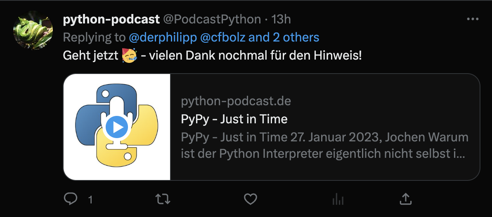

************
Social Media
************

Open Graph and Twitter/X
========================

Posts and episodes expose Open Graph and Twitter card metadata for social previews.
Cover images are used as the default social preview image, with the blog cover image
as a fallback when a post or episode has no cover image.

Social preview images are generated automatically using a 1200x630 rendition with
focal point cropping. The generated image is used for `og:image` and `twitter:image`,
and absolute URLs are emitted for social scrapers.

Twitter/X cards
===============

Posts use `summary_large_image` to match the 1.91:1 social rendition. Episodes with
audio use the `Twitter Player Card <https://developer.twitter.com/en/docs/twitter-for-websites/cards/overview/player-card>`_
and include the same social cover image.

