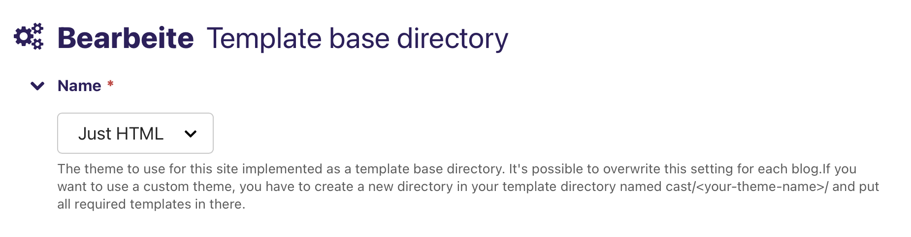
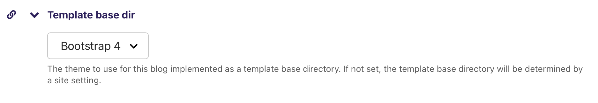

.. _themes:

******************
Templates / Themes
******************

You can choose different templates for the entire website or for specific
blogs / podcasts. All users can select these templates from the Wagtail
admin interface. Individual users can make their own template selections,
which are stored in their session.

Built-in Themes
===============

* **Plain HTML** (``plain``) — minimal HTML with no CSS framework
* **Bootstrap 4** (``bootstrap4``) — the default theme, uses Bootstrap 4

External Themes
===============

* `Bootstrap 5 <https://github.com/ephes/cast-bootstrap5>`_ (``bootstrap5``)
  — a Bootstrap 5 theme with dark mode, sharing buttons, and modern layout
* `Vue.js <https://github.com/ephes/cast-vue>`_ (``vue``) — demonstrates
  how to combine a single-page application frontend with django-cast

.. _theme_selection_precedence:

Theme Selection Precedence
==========================

When a page is rendered, django-cast resolves the active theme using the
following precedence chain (highest wins):

1. **Code override** — ``request.cast_template_base_dir``, an attribute set
   directly on the request object by internal code (e.g. the styleguide
   preview).

2. **Query parameter** — ``?theme=<slug>`` or ``?template_base_dir=<slug>``.
   Provides a temporary preview for the current request only. The value is
   validated against the available theme choices. Does **not** persist to the
   session. Used for theme comparison, styleguide, and development.

3. **Session** — ``request.session["template_base_dir"]``, set when a user
   selects a theme via the ``/cast/select-theme/`` endpoint or the theme API.
   This is the canonical source of truth for the active theme: after a full
   page reload without a ``?theme`` query parameter, the rendered theme always
   matches the session value.

4. **Blog-level setting** — the ``template_base_dir`` field on the Blog page.
   Acts as a default for all users viewing that blog who have not chosen a
   theme in their session.

5. **Site-level setting** — the ``TemplateBaseDirectory`` Wagtail site
   setting. The global fallback when none of the above are set. Defaults to
   ``bootstrap4``.

See ``src/cast/models/theme.py:get_template_base_dir()`` for the
implementation.

How to Change the Theme for the Whole Site
==========================================

This setting can be found at ``Settings > Template base directory``:

There's a :doc:`context processor </reference/context-processors>` that adds the
current template base directory to the context. For convenience it also adds
the theme's base template as a variable so non-Wagtail templates can extend it.

How to Change the Theme for a Single Blog
=========================================

This setting can be found at ``Pages > ... > Blog``:

How to Change the Theme for an Individual User
===============================================

The theme selection for an individual user is stored in ``request.session``
and overrides blog and site level theme settings.

You can also override the theme per request via query parameters:

* ``?theme=<slug>``
* ``?template_base_dir=<slug>``

These overrides are validated against the available theme choices and do not
persist to the session.

JSON API
--------

You can get a list of selectable themes via the ``cast:api:theme-list``
endpoint. This endpoint will also show the currently selected theme.
If you want to update the selected theme, you can do so via
``cast:api:theme-update``.

Hypermedia
----------

The hypermedia endpoints for getting / setting the theme are:

* ``cast:theme-list`` — list of all themes (the currently selected theme
  is marked)
* ``cast:theme-update`` — update the theme for the current user

.. _theme_development_guide:

Theme Development Guide
=======================

This section explains how to create a custom theme for django-cast.

Theme Directory Structure
-------------------------

A theme is a directory inside your project's template path at
``cast/<theme_name>/``. The directory must contain a set of required template
files for django-cast to discover it as a valid theme.

.. code-block:: text

   your_project/
   └── templates/
       └── cast/
           └── my_theme/
               ├── base.html
               ├── blog_list_of_posts.html
               ├── post.html
               ├── post_body.html
               ├── episode.html
               ├── pagination.html
               ├── 400.html
               ├── 403.html
               ├── 403_csrf.html
               ├── 404.html
               └── 500.html

.. _required_templates:

Required Templates
------------------

Templates are split into two tiers: **strictly required** (must exist for
the theme to be discovered) and **soft-required** (produce a
``DeprecationWarning`` when missing but will become strictly required in a
future release).

**Strictly required** — the theme will not appear in the theme chooser without
these:

``blog_list_of_posts.html``
    The blog index page showing a paginated list of posts.

``post.html``
    The blog post detail page.

``post_body.html``
    A partial template rendering the body of a single post. Included by both
    ``post.html`` (detail view) and ``blog_list_of_posts.html`` (list view).

``episode.html``
    The podcast episode detail page. Extends ``post.html`` and adds
    audio-specific meta tags.

**Soft-required** — missing these triggers a deprecation warning:

``base.html``
    The root HTML template. All other full-page templates extend this.

``pagination.html``
    Pagination controls, included by ``blog_list_of_posts.html``.

``400.html``, ``403.html``, ``403_csrf.html``, ``404.html``, ``500.html``
    Error page templates.

Optional Templates
------------------

These templates are not required for theme discovery but provide additional
functionality:

``gallery.html``
    Default gallery layout. Renders image thumbnails with modal support.

``gallery_htmx.html``
    HTMX-powered gallery layout. Loads modal content from the server. If you
    don't need this layout, copy your ``gallery.html`` to
    ``gallery_htmx.html``.

``gallery_modal.html``
    Server-rendered modal content for the HTMX gallery.

``transcript.html``
    Episode transcript display page.

``feed_detail.html``
    RSS/Atom feed information page with subscribe links.

``select_theme.html``
    Theme selector UI (typically a dropdown in the navigation bar). Not
    required for theme discovery, but both built-in themes include it.
    (Earlier versions of this documentation referred to the file as
    ``select_template.html``; the actual file name is ``select_theme.html``.)

``follow_links.html``
    Social media and feed subscription links for the navigation.

.. _template_inheritance_chain:

Template Inheritance Chain
--------------------------

Both built-in themes follow the same inheritance pattern:

.. code-block:: text

   base.html                  ← Root template (full HTML document)
   ├── blog_list_of_posts.html  ← Blog index page
   │   ├── pagination.html       (included partial)
   │   └── post_body.html        (included partial)
   ├── post.html               ← Post detail page
   │   ├── episode.html          ← Extends post.html (podcast episode)
   │   └── post_body.html        (included partial)
   ├── transcript.html         ← Episode transcript page
   ├── feed_detail.html        ← Feed subscription page
   └── 400/403/404/500.html    ← Error pages

``post_body.html`` is a **partial** (no ```` tag). It is included
by both ``post.html`` and ``blog_list_of_posts.html`` using
````. The ``render_detail`` context variable
controls whether the full post body or just the overview is shown.

``episode.html`` extends ``post.html`` and overrides the ``social_meta`` block
to add Twitter Player Card and ``og:audio`` meta tags when the episode has an
audio file.

.. _template_blocks:

Template Blocks
---------------

The blocks available depend on the theme. The two built-in themes define
different block names for the main content area.

**bootstrap4** blocks (defined in ``base.html``):

``title``
    Page ``<title>`` tag content.

``meta``
    ``<meta>`` tags inside ``<head>``. Contains charset, viewport, and
    description by default.

``css``
    Stylesheet ``<link>`` tags. Loads Bootstrap 4 CSS by default.

``headerscript``
    Scripts loaded in ``<head>`` (before body).

``additionalheaders``
    Additional ``<head>`` content.

``navigation``
    The navigation bar. Includes theme selector and follow links.

``messages``
    Django messages framework display area.

``content``
    The main page content area inside a ``
``.

``modal``
    Container for modal dialogs (after main content, before scripts).

``javascript``
    Scripts loaded at the end of ``<body>``. Includes jQuery, Bootstrap JS,
    and HTMX by default.

``template_script``
    Additional scripts inside the ``javascript`` block.

**plain** blocks (defined in ``base.html``):

``meta``
    ``<meta>`` tags (wraps ``robots``, ``title``, ``description``).

``robots``
    Robots meta tag.

``title``
    Page ``<title>`` tag.

``description``
    Meta description tag.

``css``
    Stylesheet ``<link>`` tags.

``header``
    Page header area.

``navigation``
    Navigation area.

``main``
    The main page content area (equivalent to ``content`` in bootstrap4).

``footer``
    Page footer area.

``javascript``
    Scripts loaded at the end of ``<body>``. Includes HTMX by default.

**post.html** adds (both themes):

``social_meta``
    Open Graph and Twitter Card meta tags. Nested inside the ``meta`` block.
    Override this block in ``episode.html`` to add audio-specific tags.

Context Variables Available to Templates
----------------------------------------

These context variables are set by django-cast and available in theme
templates:

**All pages:**

``blog``
    The Blog or Podcast page object.

``root_nav_links``
    List of ``(url, text)`` tuples for the site navigation.

``has_selectable_themes``
    Boolean indicating whether multiple themes are available.

``template_base_dir_choices``
    List of ``(slug, name)`` tuples for the theme selector.

``follow_links``
    Social media and subscription links configured on the blog.

**Blog index (``blog_list_of_posts.html``):**

``page``
    The blog index page object.

``posts``
    A paginated queryset of posts.

``filterset``
    The search/filter form (django-filter ``FilterSet``).

``canonical_url``
    Canonical URL for the current page.

``is_paginated``, ``has_previous``, ``has_next``, ``page_number``, etc.
    Pagination context variables.

``podlove_load_mode``
    Podlove player loading strategy (``"click"`` on list pages).

**Post detail (``post.html``):**

``page``
    The post page object.

``comments_are_enabled``
    Boolean indicating whether comments are enabled for this post.

``blog_url``
    URL back to the blog index.

``social_cover_image_url``
    Absolute URL to the 1200x630 social preview image.

``social_cover_image_width``, ``social_cover_image_height``
    Dimensions of the social cover image.

``cover_alt_text``
    Alt text for the cover image.

``absolute_page_url``
    Full absolute URL to the post.

``updated_timestamp``
    Last-published timestamp for Open Graph.

**Post body partial (``post_body.html``):**

``render_detail``
    ``True`` on detail pages (show full body), ``False`` on list pages
    (show overview only).

``render_for_feed``
    ``True`` when rendering for RSS feed output.

``podlove_load_mode``
    Podlove player loading strategy.

**Episode detail (``episode.html``):**

``episode``
    The episode page object (also available as ``page``).

``player_url``
    Absolute URL to the Twitter Player view for this episode.

Data Attributes for JavaScript Components
------------------------------------------

If your theme uses django-cast's JavaScript components, certain data
attributes are expected on HTML elements. See
:ref:`frontend_web_components` for the full specification.

**HTMX CSRF token** — the bootstrap4 and bootstrap5 themes set a global
HTMX header on the ``<body>`` tag:

.. code-block:: html+django

   <body data-hx-headers='{"X-CSRFToken": "{{ csrf_token }}"}'>

**Pagination target** — pagination links target a container with
``id="paging-area"``. Ensure your theme wraps the paginated content area
with this ID.

**Gallery web components** — if using the ``<image-gallery-bs4>`` web
component, gallery thumbnails need ``data-modal-*``, ``data-prev``, and
``data-next`` attributes. See :ref:`image_gallery_component` for details.

**Podlove player** — the ``<podlove-player>`` web component requires
``data-url``, ``data-embed``, and ``data-config`` attributes. See
:ref:`podlove_player_component` for details.

Theme Discovery
---------------

django-cast discovers themes by scanning the template directories of all
configured Django template loaders that implement ``get_dirs()``
(``FilesystemLoader``, ``CachedLoader``, ``AppDirectoriesLoader``). It
looks for directories matching the pattern ``**/cast/**/<template_name>``
and checks that each candidate contains all strictly required templates.

If your template loader does not implement ``get_dirs()``, register your
theme manually in ``settings.py``:

.. code-block:: python

   CAST_CUSTOM_THEMES = [
       ("my_theme", "My Custom Theme"),
   ]

Theme choices are cached for the lifetime of the worker process. After
adding or removing a theme, restart the Django process for changes to take
effect.

Packaging a Theme as a Django App
---------------------------------

External themes (like
`cast-bootstrap5 <https://github.com/ephes/cast-bootstrap5>`_) are packaged
as standalone Django apps. The typical structure is:

.. code-block:: text

   cast-my-theme/
   ├── pyproject.toml
   └── cast_my_theme/
       ├── __init__.py
       └── templates/
           └── cast/
               └── my_theme/
                   ├── base.html
                   ├── blog_list_of_posts.html
                   ├── post.html
                   ├── post_body.html
                   ├── episode.html
                   ├── pagination.html
                   ├── gallery.html
                   ├── gallery_htmx.html
                   └── ...

To use the theme:

1. Install the package (e.g. ``pip install cast-my-theme``).
2. Add ``"cast_my_theme"`` to ``INSTALLED_APPS``.
3. Select the theme in Wagtail admin or via the theme API.

No ``CAST_CUSTOM_THEMES`` entry is needed — Django's built-in template
loaders (``AppDirectoriesLoader``, ``FilesystemLoader``) all implement
``get_dirs()`` and support automatic theme discovery.

Galleries
=========

Galleries can have different layouts. Currently there are two layouts:

* ``default`` — uses the ``cast/<theme>/gallery.html`` template
* ``htmx`` — uses the ``cast/<theme>/gallery_htmx.html`` template

If you don't want to implement the HTMX layout, you can copy your
``gallery.html`` template to ``gallery_htmx.html``.

An additional template ``cast/custom/audio.html`` can be overridden to
customize the audio player rendering.

Error Views
===========

If you want to use your own error views, create templates for each error
code in your theme's directory:

* ``cast/<theme>/400.html``
* ``cast/<theme>/403.html``
* ``cast/<theme>/403_csrf.html``
* ``cast/<theme>/404.html``
* ``cast/<theme>/500.html``

Since the error views need to know which theme to use, override the default
error views in your project's root URL-conf:

.. code-block:: python

    from cast.views import defaults as default_views_cast

    handler400 = default_views_cast.bad_request
    handler403 = default_views_cast.permission_denied
    handler404 = default_views_cast.page_not_found
    handler500 = default_views_cast.server_error

Setting the view for the 403 CSRF error is a special case. Specify the view
in your project's settings:

.. code-block:: python

    CSRF_FAILURE_VIEW = "cast.views.defaults.csrf_failure"
