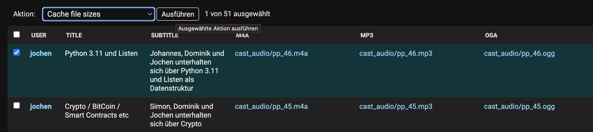

************
Django-Admin
************

Django Cast registers several models in the Django admin with custom actions
and configuration.

Admin Actions
=============

Cache file sizes (Audio)
-------------------------

The file sizes of audio objects are cached in metadata for display purposes.
New uploads are cached automatically, but for older audio objects you can
update the cache in bulk:

1. Go to Django Admin > Audio
2. Select the audio objects to update
3. Choose "Cache file sizes" from the action dropdown

Retrain spam filter (SpamFilter)
---------------------------------

The Naive Bayes spam filter can be retrained from scratch using comments
that have been manually classified as spam or ham:

1. Go to Django Admin > Spam Filters
2. Select the spam filter to retrain
3. Choose "Retrain model from scratch using marked comments" from the action dropdown

The admin list view shows precision and recall metrics for each filter,
helping you assess filter quality.

Wagtail Admin Customizations
=============================

Django Cast extends the Wagtail admin with custom menu items and editor
integrations.

Media Menu Items
-----------------

Three menu items are added to the Wagtail admin sidebar for managing media:

- **Audio** - List, add, edit, and delete audio files with chapter marks
- **Video** - List, add, edit, and delete video files with poster images
- **Transcript** - List, add, edit, and delete transcripts

Each menu item is permission-aware and only appears for users with the
appropriate add, change, or delete permissions on the respective model.

Tags Management
----------------

Tags (from ``django-taggit``) are registered as a Wagtail snippet, providing
a CRUD interface for managing tags directly in the Wagtail admin under
the Snippets menu.

Editor Integration
-------------------

Audio and video chooser URLs are injected into the Wagtail page editor,
enabling the audio and video chooser modals when editing StreamField
content blocks.

Page Link Caching
------------------

Django Cast registers a custom rich text link handler that caches page
URLs. This improves performance when rendering pages with many internal
links by avoiding repeated database lookups.
