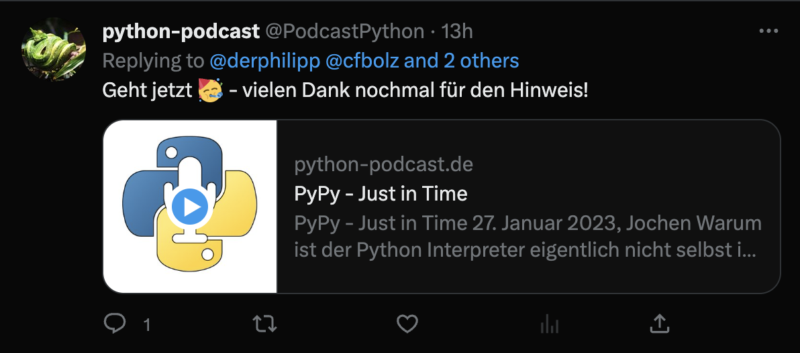

Social Media
============

Twitter
-------

If you share a link to a detail page of an episode, there will
be a `Twitter Player Card <https://developer.twitter.com/en/docs/twitter-for-websites/cards/overview/player-card>`_
added to your tweet. At the moment you have to generate the
metadata manually. For an example have a look at
`this episode template <https://github.com/ephes/python-podcast/blob/main/python_podcast/templates/cast/episode.html>`_.

