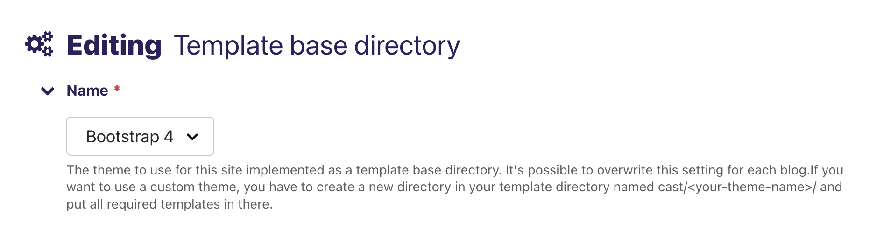

******************
Templates / Themes
******************

You can choose different templates for the entire website or for specific
blogs / podcasts. All users can select these templates from the Wagtail
admin interface. Individual users can make their own template selections,
which are stored in their session.

* Plain HTML (plain) - This is just a plain HTML template without any
  CSS
* Bootstrap 4 (bootstrap4) - This is a template that uses Bootstrap 4
  and is currently the default template
* `Bootstrap 5 (bootstrap5) <https://https://github.com/ephes/cast-bootstrap5>`_
  - This is a template that uses Bootstrap 5 and is the theme that I usually
  use for my own projects
* `Vue.js <https://https://github.com/ephes/cast-vue>`_ - This is a template
  that uses Vue.js and demonstrates how to combine an SPA frontend with
  django-cast

If you want to use your own templates, you can do so by overwriting the
built-in templates or creating a new directory in your project's
`templates` directory and name it `cast/{your_template_name}`. Then
you can create your own templates in this directory. After all of
the following template names are added, you should be able to select
your custom template in the Wagtail admin interface.

.. important::

    This is the minimal list of templates that have to be implemented
    for a template named **minimal**:

    * `cast/minimal/base.html`
    * `cast/minimal/blog_list_of_posts.html`
    * `cast/minimal/post.html`
    * `cast/minimal/post_body.html`
    * `cast/minimal/episode.html`
    * `cast/minimal/select_template.html`

.. hint::

    It's only possible to create own template themes with template
    loaders that implement the `get_dirs` method (FilesystemLoader,
    CachedLoader). If you want to use a template loader that doesn't
    implement the `get_dirs` method, you have to add it to
    ``settings.CAST_CUSTOM_THEMES``.

Galleries
=========

Galleries can have different layouts. Currently there are two layouts:

- `default` - This is the default layout which will use the `cast/minimal/gallery.html` template
- `htmx` - Which will use the `cast/minimal/gallery_htmx.html` template

If you don't want to implement the htmx layout, you can just copy your
`cast/minimal/gallery.html` template to `cast/minimal/gallery_htmx.html`.

How to Change the Theme for the whole Site
==========================================

This setting can be found at `settings > Template base directory`:

There's a :doc:`context processor <context-processors>` that adds the
current template base directory aka theme to the context. For convenience
it also adds the theme's base template as a variable to the context to
be able to extend it in non Wagtail templates.

Error Views
-----------

If you want to use your own error views, you can do so by creating templates
for each error code in your theme's directory.

.. hint::

    This is the list of templates that you can overwrite

    * `cast/your_theme/404.html`
    * `cast/your_theme/500.html`
    * `cast/your_theme/400.html`
    * `cast/your_theme/403.html`
    * `cast/your_theme/403_csrf.html`

Since now the error views need to know which theme to use, you have to
overwrite the default error views in your project's root URL-conf:

.. code-block:: python

    ...
    from cast.views import defaults as default_views_cast

    handler404 = default_views_cast.page_not_found
    handler500 = default_views_cast.server_error
    handler400 = default_views_cast.bad_request
    handler403 = default_views_cast.permission_denied

Setting the view for the 403_csrf error is a special case. You have to
specify the view in your project's settings:

.. code-block:: python

    ...
    # view handling csrf failures
    CSRF_FAILURE_VIEW = "cast.views.defaults.csrf_failure"

How to Change the Theme for a Single Blog
=========================================

This setting can be found at `pages > ... > Blog`:

.. image:: images/blog_template_base_dir_setting.png
  :width: 600
  :alt: Set the theme or "template base directory" for a single blog

How to Change the Theme for an Individual User
==============================================

The theme selection for an individual user is stored in `request.session`
and does overwrite blog and site level theme settings.

JSON-Api
--------

You can get a list of selectable themes via the `cast:api:theme-list`
endpoint. This endpoint will also show the currently selected theme.
If you want to update the selected theme, you can do so via
`cast:api:theme-update`.

Hypermedia
----------

The hypermedia endpoints for getting / setting the theme are:

* `cast:theme-list` - List of all themes (the currently selected theme
  is marked)
* `cast:theme-update` - Update the theme for the current user
